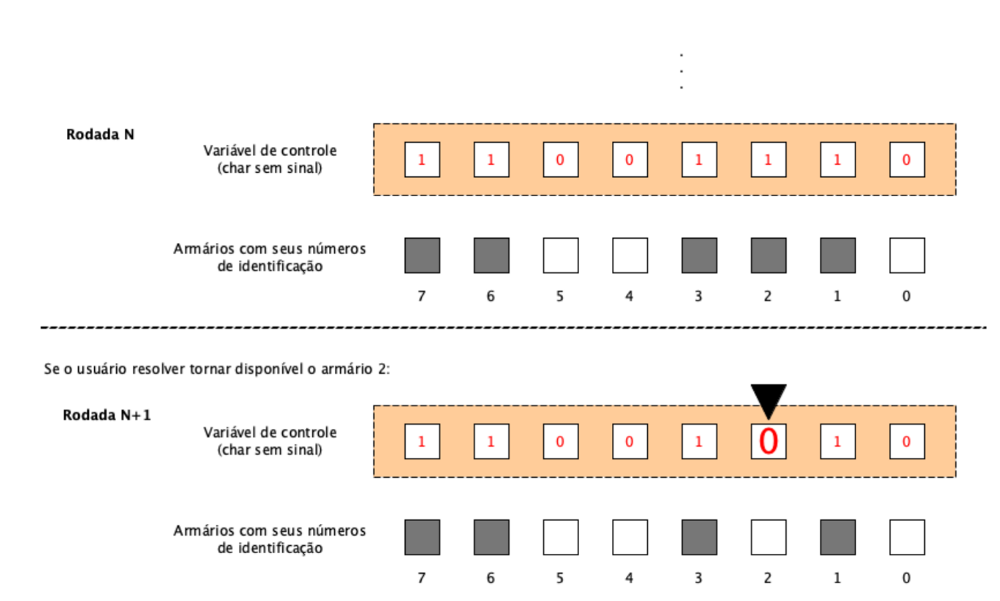

    DESAFIO 01

Imagine que você foi contratado para desenvolver um sistema para gerenciar os armários de alunos de uma universidade. Inicialmente, você terá que fazer uma prova de conceito para 8 armários. Devido às limitações de memória no dispositivo onde seu código será embarcado, você optou por utilizar um mapa de bits. Dessa forma, para cada armário você irá associar um bit, sendo 0 para disponível e 1 para ocupado. Você dever ́a usar uma UNICA variável do tipo char sem sinal para controle. Não utilize vetores.

O sistema funcionará da seguinte forma: Inicialmente, você deve exibir um menu para o usuário com as seguintes opções:

1. Ocupar armário.
2. Liberar armário.
3. Sair.

Sempre que o usuário digitar a opção 1, você deve escolher um armário aleatoriamente dentre os disponíveis e ocupar, ou seja, colocar o bit correspondente na variável de controle em 1. O programa deve iniciar com todos os armários desocupados. Quando o usuário digitar a opção 2, o programa deve pedir a posição do armário para ser desocupado e colocar o bit correspondente em zero na variável de controle. O programa deve sair quando a opção 3 for a escolhida pelo usuário.

Observe a ilustração abaixo:

• Utilize operadores bit-a-bit para ligar e desligar os bits na variável de controle e controlar quais armários estão livres e quais estão ocupados. Não use vetores.

• Para geração de números aleatórios, pesquise sobre a função rand().

• Em cada rodada do programa, apresente os armários que estão ocupados e os que est ̃ao livres.
